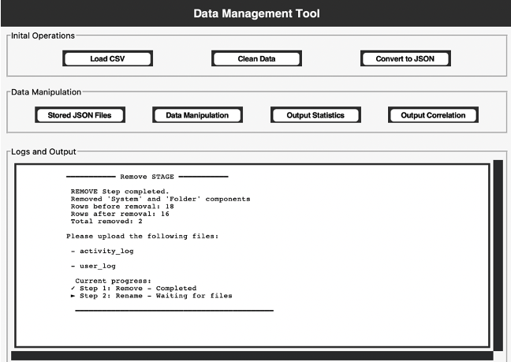
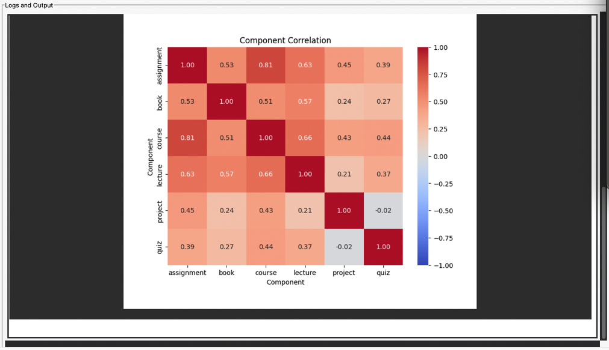
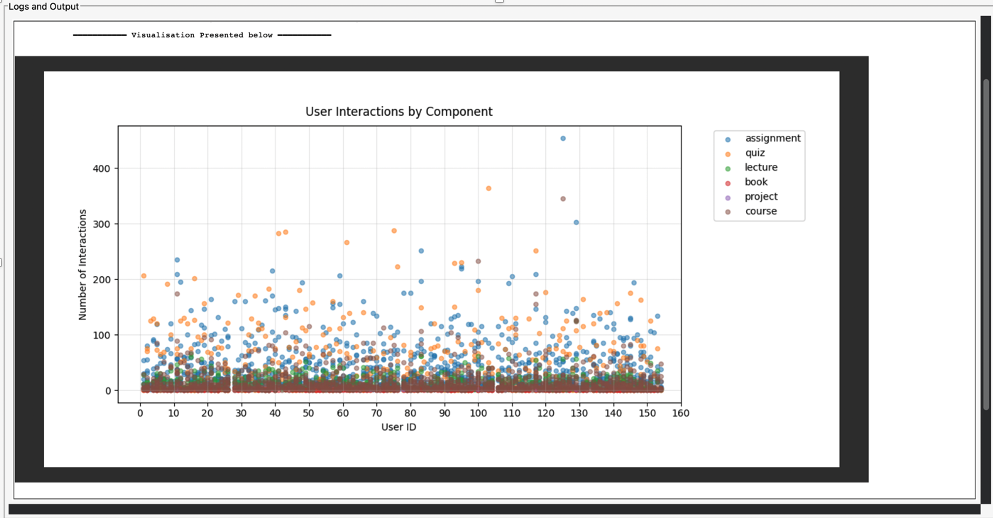

# Data Visualisation and Reporting Tool

## 📝 Project Description

This is a **GUI-based desktop application** designed to help clients interact with raw data in a user-friendly way. The application allows users to upload CSV files, which are then **automatically cleaned and structured** into JSON format.

Through the interface, users can:

- Upload and review their data
- Apply cleaning and transformation steps
- View reports and visual insights through interactive charts

The goal is to simplify data handling and provide clients with **ready-to-use visual reports** that support decision-making.

## 🧰 Features

- 📂 Upload CSV files through a GUI
- 🔄 Convert to JSON format
- 🧼 Clean and transform raw data automatically
- 📊 Generate client-ready visual reports
- 💾 Save and reuse processed data for future reporting

## 🧰 Tools & Libraries Used

- **Pandas** – for reading, cleaning, and manipulating CSV data
- **Seaborn** – for creating visually appealing charts
- **MATLAB** – integrated for advanced data processing or chart generation
- **Tkinter** – for a simple GUI that lets users load files easily

## 🖼️ Screenshots

### 🖥️ GUI Interface Example



### 📊 Sample Report Output




## 🚀 How to Run

1.  Clone the repo:

```bash
git clone https://github.com/yourusername/data_viz_converter.git
cd data_viz_converter
```

2.  Install the required libraries:
    pip install pandas seaborn matplotlib notebook
3.  Launch Jupyter Notebook:
    jupyter notebook
